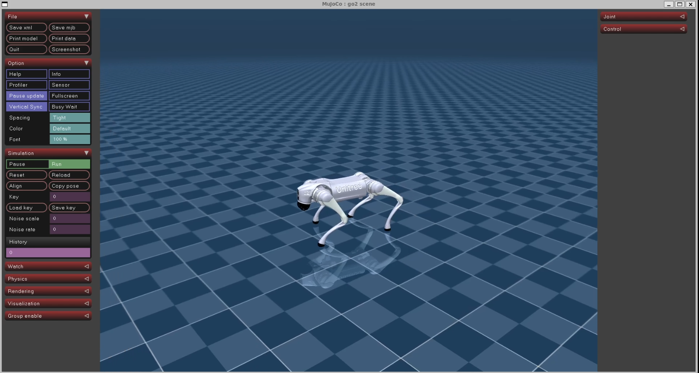

# Unitree Go2 Data Recorder


This project contains code to convert Unitree Go2 real-world data to MuJoCo, visualization and conversion to numpy!

# 

# ⭐ Key Features
- ROS2 bag compatible
- Synchronization
- Timestamps for each step
- Visualization
- Numpy compatible output format
- Supports unitree and [go2_odometry](https://github.com/inria-paris-robotics-lab/go2_odometry) for base state estimation!

# 💾 Extracted Data
The following data is stored:
Low cmd:
- q (position, 12 motors)
- dq (velocity, 12 motors)
- tau (12 motors)
- kp (12 motors)
- kd (12 motors)

Low state:
- quaternion
- gyroscope
- d (position, 12 motors)
- dq (velocity, 12 motors)
- tau_est (12 motors)
- q_raw (12 motors)
- dq_raw (12 motors)

Sport state mode:
- base position
- base velocity

> **Note**  
> Sport state mode is not available when the robot is in low state mode (e. g. if you want to record policy data).

You can replace the sport state mode by using [go2_odometry](https://github.com/inria-paris-robotics-lab/go2_odometry).
After setting it up, in `src/extractor/extractor.h`, make sure this line is set to true:
```c++
#define USE_ODOMETRY true
```
Make sure your environment is properly sourced and use the `ROS_DOMAIN_ID` described below!

# 💻 Installation
Don't forget to install the dependencies:

- [unitree_ros2](https://github.com/unitreerobotics/unitree_ros2): Only tested with Humble!
- [unitree_sdk2](https://github.com/unitreerobotics/unitree_sdk2)
- [mujoco](https://github.com/google-deepmind/mujoco) (version 3.2.7)
- [cnpy](https://github.com/rogersce/cnpy)
- `sudo apt install libglfw3-dev libxinerama-dev libxcursor-dev libxi-dev`

Important: You must build MuJoCo from source, it is not enough to install the precompiled version!

> Note: This project also contains a simple robot trajectory, written with Unitree SDK, but it uses the old method: `switchGait`. If you are interested in this,
checkout the commit `3a4680ae9b00df59e60f7e63cfb0fcc432a9d08d` in `unitree_sdk2` before installing it.  

Make sure all dependencies are installed and available in your system path. Then build the project with:
```zsh
git clone https://github.com/DerSimi/unitree_go2_to_mujoco && cd unitree_go2_to_mujoco
mkdir build && cd build
cmake .. && make
```
Note, if you see any errors, source your unitree ros2 workspace, especially, source `setup.sh` and `install/setup.sh`.

To run the extractor in the build directory:
```zsh
./mujoco_extractor
```

# Python Installation

If required, the created `.npy` file in the `build` directory can be rendered using Python.
See `renderer/play.py` for an example of how to use the generated `.npy` file.


Install all Python dependencies using `uv` or a package manager of your liking:
```zsh
uv venv --python 3.12
source .venv/bin/activate
uv pip install -r requirements.txt
```

Then run the code in `renderer/play.py`:
```zsh
python renderer/play.py
```

# Sample Data and Usage

The `samples` folder contains a sample ROS2 bag file and a ready-to-use `.npy` file.

The sample data was recorded using:
```zsh
ros2 bag record /lowstate /lowcmd /sportmodestate -o recording07082
```

Make sure you installed [unitree_ros2](https://github.com/unitreerobotics/unitree_ros2) and properly sourced the environment, otherwise ros can't find the topic packages.
To get the setup working, run the following commands:
```
source 'source ~/unitree_ros2/setup_local.sh'
export ROS_DOMAIN_ID=1
source ~/unitree_ros2/install/setup.sh
```

To use the sample data:
1. Unpack the archive in the `samples` folder if needed.
2. Start `mujoco_extractor` in a seperate terminal. Go to the build directory and run:
	```zsh
	./mujoco_extractor
	```
3. In a second terminal, play the bag file:
	```zsh
	ros2 bag play recording07082
	```
	The robot will walk in circles with varying gait cycles. When it sits down, close the MuJoCo renderer by hand. The program will then save `storage.npy` in the build folder. Do not use `Ctrl+C` to exit.

For Python visualization:

- If you created `storage.npy` yourself by playing the rosbag and running the extractor, you can run the visualization directly:
	```zsh
	python renderer/play.py
	```
- If you want to use the sample data, copy `storage.npy` from the `samples` folder into the `build` directory first, then run the same command above.

# Details on Synchronization and Timestamp Feature
You will notice that the recording contains a different number of messages for each relevant topic. This requires a synchronization strategy. I chose to use the topic with the most messages, which is `/lowcmd`, as the reference. The program always takes the oldest `/lowcmd` message in the buffer and searches for the closest (but not newer) messages from the other topics. 

Note that the timestamps here are based on the (rather inaccurate) PC time, since there are no timestamps available in `/lowcmd` and `/lowstate`.

# Credits
This project is based on a heavily rewritten version of the work from [unitree_mujoco](https://github.com/unitreerobotics/unitree_mujoco). The XML model is also adapted from that repository.
